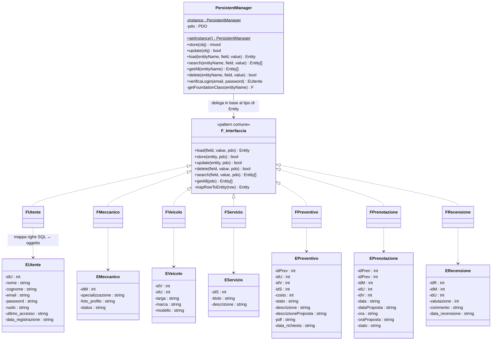
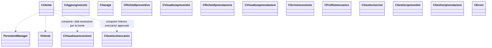
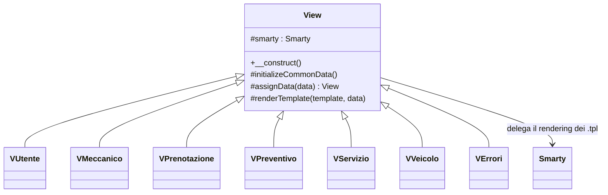

# Diagramma delle classi

Il codice lato server è organizzato in 4 livelli (`Foundation`, `Entity`, `Control`, `View`) più un
front controller. Di seguito il diagramma per livello, invece di un unico grafo (sarebbe
illeggibile con oltre 30 classi).

## 1. Front Controller e infrastruttura trasversale

```mermaid
classDiagram
    class FrontController {
        +run()
    }
    class AccessControl {
        -rules : array
        -default : string
        +verifica(controllerInput, method) string
    }
    class Session {
        +start()
        +set(key, value)
        +get(key)
        +has(key)
        +remove(key)
        +destroy()
    }
    class Request {
        +post(key, default) mixed
        +get(key, default) mixed
        +hasPost(...keys) bool
        +method() string
        +isPost() bool
    }
    class Cookie {
        +get(key, default) mixed
        +has(key) bool
        +set(key, value, days)
        +delete(key)
    }

    FrontController --> AccessControl : verifica permessi
    FrontController --> Request : legge url/metodo HTTP
    FrontController ..> "C*" : istanzia ed invoca

    note for AccessControl "Incapsula $_SESSION indirettamente\ntramite Session per leggere il ruolo corrente"
    note for Request "Incapsula $_POST / $_GET / $_SERVER:\nnessun controller le tocca direttamente"
    note for Cookie "Incapsula $_COOKIE / setcookie():\nusata per il 'ricordami' in login"
```

## 2. Livello dati: Entity + mini-ORM (Foundation)

Tutte le classi `F<Nome>` (una per entità) implementano la stessa interfaccia informale — non è
dichiarata a codice come `interface` PHP, ma il pattern è identico ovunque:



`EMeccanico` estende concettualmente `EUtente` (un meccanico è un utente con dati aggiuntivi),
ma nel codice è un'entità a parte con la stessa PK dell'utente corrispondente (vedi
`docs/modello-concettuale.md`).

## 3. Livello applicativo: Controller

Un controller per macro-funzionalità (non uno per entità): riceve la richiesta dal
`FrontController`, usa `PersistentManager` per i dati e una classe `View/V<Nome>` per la
presentazione. Elenco completo in [`docs/casi-uso.md`](casi-uso.md).



## 4. Presentazione: View + Smarty



`View` centralizza la configurazione di Smarty (cartelle template/compile/cache) e i dati comuni a
ogni pagina (`isLogged`, `userRole`, `nomeUtente`), lette da `Session`.
