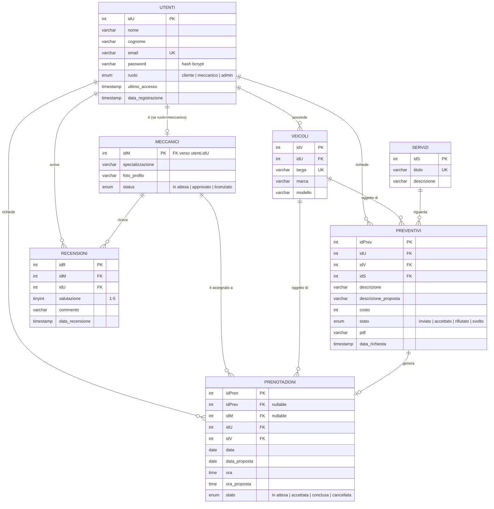

# Modello concettuale (ER)

Schema derivato da `database.sql`. Chiave: `PK` = chiave primaria, `FK` = chiave esterna.

## Note sul modello

- `meccanici` è in relazione 1:1 con `utenti` (condivide la PK come FK, pattern "sottoclasse
  tabella separata"): un meccanico *è* un utente con dati aggiuntivi, non un'entità indipendente.
- Tutte le FK sono `ON DELETE CASCADE`, eccetto `prenotazioni.idM` (`ON DELETE SET NULL`, per non
  perdere lo storico prenotazioni se un meccanico viene rimosso).
- `preventivi` e `prenotazioni` sono disaccoppiati ma collegabili: una prenotazione può nascere da
  un preventivo accettato (`prenotazioni.idPrev`) oppure essere richiesta direttamente, senza
  preventivo (campo nullable).
- Vincoli di unicità: `utenti.email`, `veicoli.targa`, `servizi.titolo`.
- Non è presente un vincolo di unicità `(idM, idU)` su `recensioni` per imporre "una sola
  recensione per meccanico per utente": la regola è attualmente enforced solo a livello applicativo
  (nessun controller la applica in scrittura, il che è un possibile miglioramento — vedi
  `CScrivirecensione::scrivi`, che oggi permette anche recensioni multiple dallo stesso utente
  verso lo stesso meccanico).
